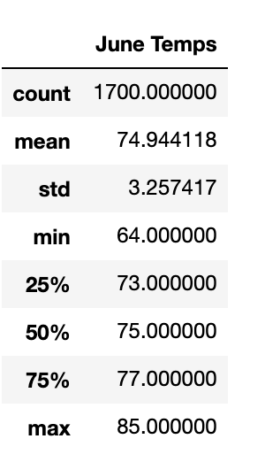
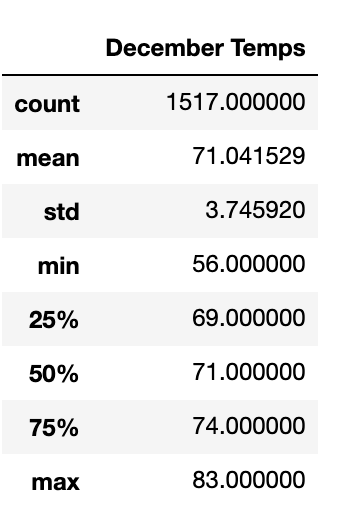

# Surfs_up

## Project Overview
An investor wants to learn more and see the trends in the weather before committing to build a Surf and Ice Cream shop in Oahu, Hawaii. The primary concern is the precipitation forcing the shop to close too frequently. To analyze Hawaii's weather data, SQLAlchemy was used to query the SQLite database.

## Results
- The average temperature in both June and December is in the 70's. June being 74.95 while December is 71.04.
- Interestingly, the maximum temperature for June and December are quite similar. June having a max temp of 85 while December is 83.
- The minimum temperature shows the greatest variance. The temperature in December drops more compared to June. The minimum temperature for December is 56 while June is 64. 

 ### Summary Statistics for Temperatures in June            

                
### Summary Statistics for Temperatures in December               

## Summary
In summary, the weather in December and June are historically very similar, although December has a wider range of results, with its high being close to June's but minimum temperature being lower than June. Additional queries that could be run include: Precipation difference between June and December to determine which experiences more rainfall and a comaparison by weather station, as we may seethe trends in temperatures and precipitation levels at different locations. However, the primary interest would be the weather station closest to our prospective location, which would narrow the results and provide the best data for us to consider.
